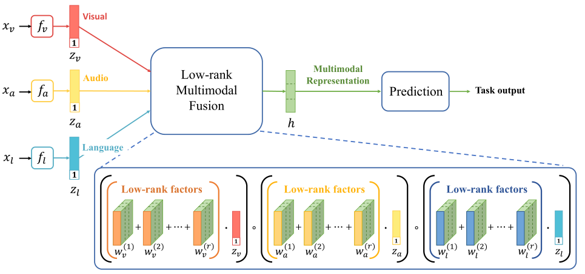

# LMF_Paddle

基于Paddle复现《Efficient Low-rank Multimodal Fusion with Modality-Specific Factors》

## 1. 简介

LMF是2018年Zhun Liu，Ying Shen等人提出的低秩多模态融合方法，文章主要贡献如下：

- 提出了一种低秩多模态融合方法，用于多模态融合。
- LMF与SOTA模型在公共数据集的三个多模态任务上进行了性能对比。
- 证明了LMF计算效率高，与以前的基于张量的方法相比，具有更少的参数。




## 2. 数据集和复现精度

### 数据集：IEMOCAP


IEMOCAP数据集是151个录制对话的视频集合，每个会话有2个发言者，整个数据集总共有302个视频。每个片段都标注了9种情绪(愤怒、兴奋、恐惧、悲伤、惊讶、沮丧、高兴、失望和自然)。6373个视频用于训练，1775个视频用于验证，1807个视频用于测试。

### 复现精度

|                 | F1-Happy | F1-Sad | F1-Angry | F1-Neutral |
| --------------- | -------- | ------ | -------- | ---------- |
| LMF（论文精度） | 0.858    | 0.859  | 0.890    | 0.717      |
| LMF（复现精度） | 0.859    | 0.863  | 0.890    | 0.718      |


## 3. 快速使用

### 3.1 环境准备

实验环境
- Python：3.8.5
- PaddlePaddle：2.2.2

数据集下载

[下载链接](https://pan.baidu.com/s/1rg9Pgol9MG3EZyDlmHa6bA) ，提取码：ag52

将数据放在 data 文件夹中


### 3.2 结果验证


```bash
bash run_lfm.sh
```

输出示例：

```
Start testing happy......
Audio feature dimension is: 74
Visual feature dimension is: 35
Text feature dimension is: 300
Model initialized
F1-score on test set is 0.8592420944673743
Accuracy score on test set is 0.8710021321961621

Start testing sad......
Audio feature dimension is: 74
Visual feature dimension is: 35
Text feature dimension is: 300
Model initialized
F1-score on test set is 0.862597215789817
Accuracy score on test set is 0.8667377398720683

Start testing angry......
Audio feature dimension is: 74
Visual feature dimension is: 35
Text feature dimension is: 300
Model initialized
F1-score on test set is 0.8900815592777207
Accuracy score on test set is 0.8891257995735607

Start testing neutral......
Audio feature dimension is: 74
Visual feature dimension is: 35
Text feature dimension is: 300
Model initialized
F1-score on test set is 0.7183055564744968
Accuracy score on test set is 0.7217484008528785
```

### 3.3 模型训练

```
train.sh
```

训练日志位于 train_log 文件夹下，模型存储在 check 文件夹下


## 4. 参考链接与文献

1. [Efficient Low-rank Multimodal Fusion with Modality-Specific Factors](https://arxiv.org/abs/1806.00064)
2. 参考repo：[Low-rank-Multimodal-Fusion](https://github.com/Justin1904/Low-rank-Multimodal-Fusion)

